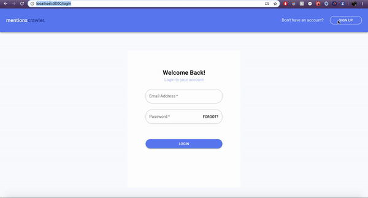
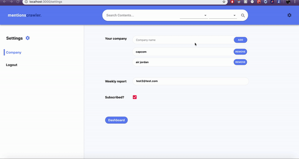
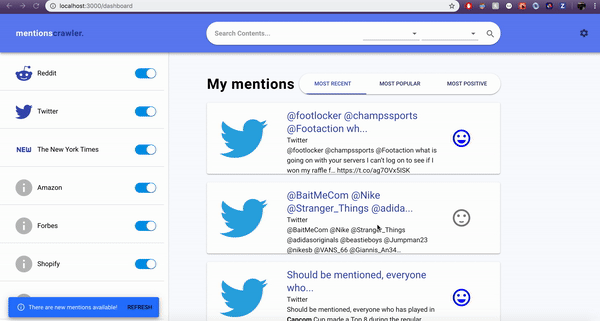
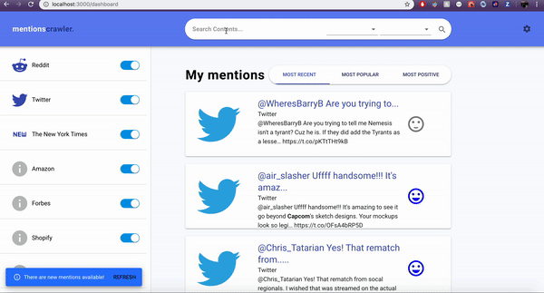
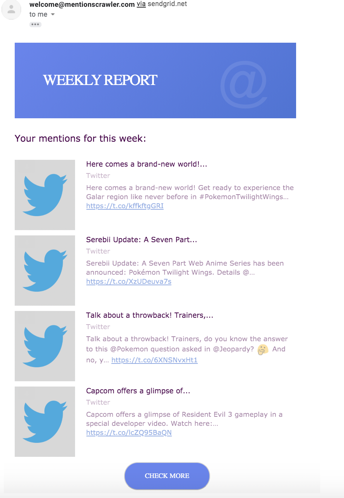

# Mentions Crawler

Mentions Crawler is a web application that allows employees/owners of companies to track content written about their company on different platforms like Reddit, Twitter, New York Times, etc.

## Contributors

[Ahana Ghosh](https://github.com/ahana15), [Derek Jou](https://github.com/derekjou), [Nicky Cen](https://github.com/ncen5293)

## Tech/Framework

Our Stack:

- React.js/Material UI
- Express/Node.js
- MongoDB
- Redis
- Socket.io
- JWT
- Twilio SendGrid
- Bcrypt

# Installations

1. Add API Key Dependencies to the project (see **Adding API Key Dependencies** below for instructions)
2. cd to the client directory (front-end)
3. Install dependencies via `npm install`
4. start the app via `npm start`
5. Head to http://localhost:3000 on the browser
6. cd to the server directory (back-end)
7. Install dependencies via `npm install`
8. run server via `npm start`
9. server will run on http://localhost:4000

### Adding API Key Dependencies

This program requires the following API keys.
These can be obtained here (follow the instructions on the website links):

- [Twitter API](https://developer.twitter.com/en/docs/basics/authentication/guides/access-tokens)
- Reddit API
  - [Snoowrap](https://not-an-aardvark.github.io/reddit-oauth-helper/)
  - [Reddit](https://www.reddit.com/prefs/apps/)
- [Twilio Sendgrid API](https://sendgrid.com/)
- [New York Times API](https://developer.nytimes.com/apis)

1. Add a `.env` file under `server/` with a key-value pairs matching the `.env.template`
    
    
   Note:
    
   `REDIS_AUTH={{BY DEFAULT THIS IS redis://127.0.0.1:6379}}`
    

# Features

### Feature Overview

- Track one or more companies
- Scrub data through platforms such as Reddit, Twitter and New York Times
- Live update notifications
- Simple and detailed view of mentions
- Mentions Search and Sorting Functionality
- Backend Pagination and Infinite Scroll
- Sentiment Analysis
- Reminder Email Prompt
- Weekly Email Reports

### Feature Description

- **Tracking Companies:** User can track more than one company. Snackbars help the user know whether companies have been added or removed.
- **Platforms:** User can track mentions on Reddit, Twitter and New York Times. User can toggle the platforms to show/hide mentions from these platforms.
- **Live Update Notifications:** User is notified to refresh the page if there are new mentions. This is done via a redis queue. A job to check if there are new mentions is added when a user either registers/logins. The job is repeated for a specifc amount of time (30 seconds for demo purposes)
- **Simple and detailed view of mentions:** User can click on a mention. A dialog box opens with the entire content of the mention along with a link to the original source of the mention.

  
   

- User can only add unique company names. User can also choose to subscribe from weekly email reports.

  
   

- **Sorting Functionality:** Mentions can be sorted either by most recent, most popular and most positive.
- **Sentiment Analysis:** Mentions have either a blue, grey or red face emoticon to indicate the general tone of the post. Hovering over the face emoticon indicates the comparative score of the post. The score ranges from -1 to +1. The more positive the number the more positive the post. The more negative the number the more negative the post.
- **Backend Pagination & Infinite Scroll**

  
   

- **Search Functionality:** Users can search for mentions containing key words in the body of the post.

  
   

- **Reminder Email Prompt:** User is reminded to interact with the application via an email if they have never seen the dashboard. This is done using a redis queue. A job is added to the queue if the user log's out without clicking the dashboard.

  
   

- **Weekly Email Reports:** User receives a weekly report with the four most popular mentions of the week. This is also done using a redis queue. A repeated job is added to the queue once the user clicks on dashboard for the first time or if they subscribe for emails after they have unsubscribed.
  
   
